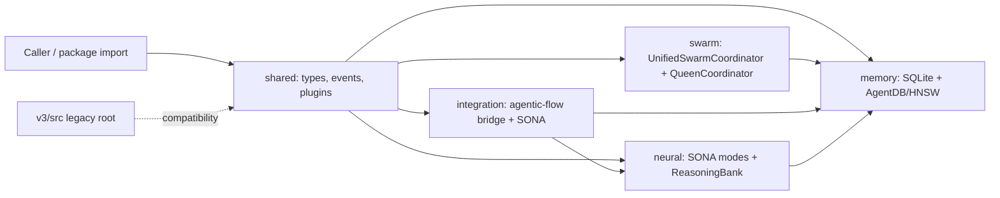

# V3 Core Runtime
Last updated: 2026-03-21

## Purpose
This document describes the live V3 runtime surface as implemented in the package barrels and source trees under `v3/@claude-flow/*` and `v3/src`. It focuses on the code that actually coordinates agents, stores memory, bridges to agentic-flow and SONA, and exposes the legacy compatibility root.

## Status
| Surface | Status | What is actually implemented |
|---|---|---|
| `@claude-flow/shared` | `active` | Shared contracts, event sourcing, plugin infra, hooks, resilience, security helpers, MCP utilities, and core orchestrator/config interfaces. |
| `@claude-flow/swarm` | `active` | Canonical swarm runtime with `UnifiedSwarmCoordinator`, `QueenCoordinator`, `TopologyManager`, consensus engines, worker dispatch, and agent pools. |
| `@claude-flow/memory` | `active` | Unified memory service, AgentDB backend, SQLite backend, hybrid routing, HNSW indexing, learning persistence, and RVF migration/store helpers. |
| `@claude-flow/integration` | `active` | `AgenticFlowBridge`, SONA adapter, attention/SDK bridges, feature flags, worker pools, and routing helpers. |
| `@claude-flow/neural` | `active` | SONA manager, ReasoningBank, PatternLearner, learning modes, RL algorithms, and agentic-flow SONA integration. |
| `v3/src` | `legacy` | Older domain/application root with `Agent`, `Task`, `Memory`, `SwarmCoordinator`, `WorkflowEngine`, plugins, and MCP infrastructure. |
| `v3/index.ts` | `historical/unverified` | Root barrel still points at missing top-level trees; it is not the authoritative import surface. |
| `v3/README.md` | `supporting asset` | Helpful overview, but it under-documents the live package split and the legacy compatibility boundary. |

## Covered Areas
| Runtime layer | Status | Notes |
|---|---|---|
| Shared contracts and infra | `active` | `shared` defines the common event/types/plugin contract surface that every other runtime layer leans on. |
| Swarm coordination | `active` | The coordination layer now centers on a single coordinator path, with queen-led delegation, topology management, consensus, and workers. |
| Memory persistence and search | `active` | Structured writes go to SQLite, semantic search goes to AgentDB/HNSW, and the hybrid backend dual-writes and routes queries. |
| Integration boundary | `active` | The integration package bridges to agentic-flow, delegates SONA/attention when available, and keeps a local fallback path. |
| Neural learning | `active` | Neural runtime is split into SONA mode management, ReasoningBank learning, pattern extraction, and RL algorithms. |
| Legacy orchestration root | `legacy` | `v3/src` still exposes the older Agent/Task/Memory roots plus `SwarmCoordinator` and `WorkflowEngine` for compatibility. |

## Key Entry Points
| Area | Key files | Role |
|---|---|---|
| Shared | [`v3/@claude-flow/shared/src/index.ts`](../../v3/@claude-flow/shared/src/index.ts), [`v3/@claude-flow/shared/src/events/index.ts`](../../v3/@claude-flow/shared/src/events/index.ts), [`v3/@claude-flow/shared/src/types/index.ts`](../../v3/@claude-flow/shared/src/types/index.ts), [`v3/@claude-flow/shared/src/plugin-interface.ts`](../../v3/@claude-flow/shared/src/plugin-interface.ts) | Canonical exports for contracts, events, plugin contracts, and shared runtime utilities. |
| Swarm | [`v3/@claude-flow/swarm/src/index.ts`](../../v3/@claude-flow/swarm/src/index.ts), [`v3/@claude-flow/swarm/src/unified-coordinator.ts`](../../v3/@claude-flow/swarm/src/unified-coordinator.ts), [`v3/@claude-flow/swarm/src/queen-coordinator.ts`](../../v3/@claude-flow/swarm/src/queen-coordinator.ts), [`v3/@claude-flow/swarm/src/topology-manager.ts`](../../v3/@claude-flow/swarm/src/topology-manager.ts), [`v3/@claude-flow/swarm/src/consensus/index.ts`](../../v3/@claude-flow/swarm/src/consensus/index.ts), [`v3/@claude-flow/swarm/src/workers/index.ts`](../../v3/@claude-flow/swarm/src/workers/index.ts) | Canonical swarm runtime, including queen delegation, topology, consensus, and worker dispatch. |
| Memory | [`v3/@claude-flow/memory/src/index.ts`](../../v3/@claude-flow/memory/src/index.ts), [`v3/@claude-flow/memory/src/agentdb-backend.ts`](../../v3/@claude-flow/memory/src/agentdb-backend.ts), [`v3/@claude-flow/memory/src/hybrid-backend.ts`](../../v3/@claude-flow/memory/src/hybrid-backend.ts), [`v3/@claude-flow/memory/src/sqlite-backend.ts`](../../v3/@claude-flow/memory/src/sqlite-backend.ts), [`v3/@claude-flow/memory/src/hnsw-index.ts`](../../v3/@claude-flow/memory/src/hnsw-index.ts) | Unified memory service, structured persistence, vector search, and hybrid routing. |
| Integration | [`v3/@claude-flow/integration/src/index.ts`](../../v3/@claude-flow/integration/src/index.ts), [`v3/@claude-flow/integration/src/agentic-flow-bridge.ts`](../../v3/@claude-flow/integration/src/agentic-flow-bridge.ts), [`v3/@claude-flow/integration/src/sona-adapter.ts`](../../v3/@claude-flow/integration/src/sona-adapter.ts) | Bridge into agentic-flow and the SONA/attention stack, with fallback adapters and feature flags. |
| Neural | [`v3/@claude-flow/neural/src/index.ts`](../../v3/@claude-flow/neural/src/index.ts), [`v3/@claude-flow/neural/src/sona-manager.ts`](../../v3/@claude-flow/neural/src/sona-manager.ts), [`v3/@claude-flow/neural/src/reasoning-bank.ts`](../../v3/@claude-flow/neural/src/reasoning-bank.ts), [`v3/@claude-flow/neural/src/pattern-learner.ts`](../../v3/@claude-flow/neural/src/pattern-learner.ts), [`v3/@claude-flow/neural/src/modes/index.ts`](../../v3/@claude-flow/neural/src/modes/index.ts) | Learning-mode orchestration, trajectory storage, pattern extraction, and algorithm selection. |
| Legacy root | [`v3/src/index.ts`](../../v3/src/index.ts), [`v3/src/coordination/application/SwarmCoordinator.ts`](../../v3/src/coordination/application/SwarmCoordinator.ts), [`v3/src/task-execution/application/WorkflowEngine.ts`](../../v3/src/task-execution/application/WorkflowEngine.ts), [`v3/src/infrastructure/plugins/PluginManager.ts`](../../v3/src/infrastructure/plugins/PluginManager.ts), [`v3/src/infrastructure/plugins/Plugin.ts`](../../v3/src/infrastructure/plugins/Plugin.ts), [`v3/src/infrastructure/mcp/MCPServer.ts`](../../v3/src/infrastructure/mcp/MCPServer.ts) | Compatibility-era orchestration, workflow execution, plugin lifecycle, and MCP server surface. |

## How It Works

| Step | Runtime behavior |
|---|---|
| 1 | Consumers enter through the package barrels. `shared` supplies the common event/types/plugin contract that the rest of the runtime imports. |
| 2 | `swarm` constructs the coordination graph, selects topology and consensus strategy, and routes work through the queen, workers, and agent pools. |
| 3 | `memory` stores structured state in SQLite and semantic vectors in AgentDB/HNSW, with hybrid dual-write and query routing for exact plus vector access. |
| 4 | `integration` attempts deep delegation to agentic-flow, then falls back to local SONA, attention, SDK, and worker implementations when the external core is unavailable. |
| 5 | `neural` records trajectories, judges and distills outcomes, and evolves patterns through SONA modes, ReasoningBank, and pattern clustering. |
| 6 | `v3/src` remains a compatibility root for older imports, but it should be treated as legacy rather than the canonical runtime surface. |

## Why It Is Designed This Way
| Design choice | Why it exists |
|---|---|
| Shared contract layer | Keeps events, types, and plugin contracts stable so swarm, memory, integration, and neural can evolve independently. |
| Single swarm coordinator | Collapses the older multi-coordinator shape into one canonical runtime path for topology, consensus, queen delegation, and worker dispatch. |
| Hybrid memory backend | Uses SQLite for exact and structured access while reserving AgentDB/HNSW for semantic retrieval and learning-oriented storage. |
| Bridge-and-adapter integration | Lets the runtime delegate to agentic-flow and SONA when available without making that external core a hard failure point. |
| Separate neural learning stack | Keeps learning modes, ReasoningBank, and pattern extraction separate from task execution so optimization can be tuned independently. |
| Legacy compatibility root | Preserves older imports while the package barrels carry the live runtime semantics. |

## Dependencies
| Surface | Manifest/runtime dependencies | Meaning for runtime |
|---|---|---|
| `@claude-flow/shared` | `sql.js` | Shared runtime ships with event and core support; the package also houses hooks, resilience, security, and MCP utilities in source. |
| `@claude-flow/swarm` | Node `events` plus internal module graph | Coordination is implemented in-repo; consensus, topology, and worker dispatch are all package-internal. |
| `@claude-flow/memory` | `agentdb`, `sql.js`, optional `better-sqlite3` | Memory uses AgentDB/HNSW for semantic search and SQLite for structured persistence, with optional native acceleration. |
| `@claude-flow/integration` | peer `agentic-flow`, optional `agent-booster` | The bridge can delegate to agentic-flow when present, but it still runs locally if the peer is absent. |
| `@claude-flow/neural` | `@claude-flow/memory`, `@ruvector/sona`, optional `agentdb` | Neural learning depends on SONA plus memory-backed reasoning and can fall back if AgentDB support is missing. |
| `v3/package.json` | Node `>=20.0.0`, pnpm `>=8.0.0`, `@ruvector/gnn` overrides | The monorepo root sets the runtime baseline and pins the ruvector GNN implementations used by the broader V3 stack. |

## Operational/Test Notes
| Area | What to verify |
|---|---|
| Shared | Export shape from `shared/src/index.ts`, event-sourcing behavior in `shared/src/events/index.ts`, and plugin registration paths in `shared/src/plugin-loader.ts` and `shared/src/plugin-registry.ts`. |
| Swarm | Canonical coordinator initialization, queen delegation, topology changes, consensus selection, and worker dispatch behavior. |
| Memory | AgentDB initialization, SQLite persistence, hybrid routing, HNSW search quality, and fallback behavior when native/vector backends are unavailable. |
| Integration | Agentic-flow delegation on/off, SONA mode switching, attention initialization, and local fallback behavior. |
| Neural | SONA mode transitions, ReasoningBank retrieval/distillation/consolidation, and pattern learner clustering/matching. |
| Legacy root | Only exercise for compatibility checks; new runtime work should target the package barrels instead of `v3/index.ts`. |

## Known Drift
| Drift | Evidence | Why it matters |
|---|---|---|
| Root barrel drift | [`v3/index.ts`](../../v3/index.ts) still imports `./core/*`, `./shared/types`, `./coordination/*`, and `./types/*` from the root, but those trees live under [`v3/src`](../../v3/src) instead. | The root barrel is not a reliable import surface for the live runtime and can mislead consumers. |
| README under-documents the live split | [`v3/README.md`](../../v3/README.md) presents the V3 runtime at a high level, but it does not describe the current `shared`/`swarm`/`memory`/`integration`/`neural` package barrels or the legacy `v3/src` compatibility root. | Readers can miss the authoritative entry points and treat older descriptions as current truth. |
| Legacy root is still present but should be fenced | [`v3/src/index.ts`](../../v3/src/index.ts) still exports `Agent`, `Task`, `Memory`, `SwarmCoordinator`, `WorkflowEngine`, plugins, and MCP infrastructure. | That surface is useful for compatibility, but it should not be the place where new runtime semantics land. |
| ruvector support is embedded in implementation paths | `@claude-flow/neural` depends on [`@ruvector/sona`](../../v3/@claude-flow/neural/package.json), while the memory backend and root manifest carry AgentDB / GNN-related support paths. | These are implementation support layers, not separate product surfaces, so docs should treat them as backend dependencies. |

## Related Docs
| Document | Why it matters |
|---|---|
| [`v3/README.md`](../../v3/README.md) | High-level V3 overview and installation/test entry point. |
| [`v3/@claude-flow/shared/README.md`](../../v3/@claude-flow/shared/README.md) | Shared contracts, events, hooks, and plugin notes. |
| [`v3/@claude-flow/swarm/README.md`](../../v3/@claude-flow/swarm/README.md) | Swarm coordination package overview and legacy compatibility notes. |
| [`v3/@claude-flow/memory/README.md`](../../v3/@claude-flow/memory/README.md) | Memory backend, AgentDB, and hybrid persistence background. |
| [`v3/@claude-flow/integration/README.md`](../../v3/@claude-flow/integration/README.md) | Agentic-flow bridge, SONA delegation, and adapter behavior. |
| [`v3/@claude-flow/neural/README.md`](../../v3/@claude-flow/neural/README.md) | SONA learning modes, ReasoningBank, and pattern learning background. |
| [`docs/architecture/v3-surfaces-and-operations.md`](./v3-surfaces-and-operations.md) | Broader runtime surface map for the workspace. |
| [`docs/architecture/v3-security-governance.md`](./v3-security-governance.md) | Security boundary and enforcement notes that complement this runtime view. |
