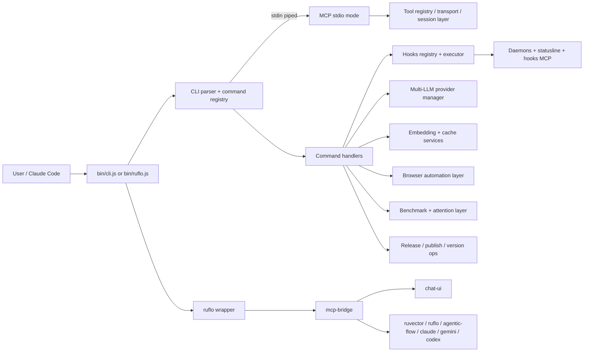

# V3 Surfaces and Operations
Last updated: 2026-03-21

## Purpose
This document explains how requests enter Claude Flow V3, how they are routed through CLI, MCP, and hooks, and where the supporting runtime layers fit in. It is based on implementation and package manifests, with a separate callout for drift that can be verified in this workspace.

## Status
| Surface | Status | Why |
|---|---|---|
| `@claude-flow/cli` | `active` | Main user entry; command shell plus MCP auto-detection. |
| `@claude-flow/mcp` | `active` | Standalone MCP runtime with registry, transports, sessions, and sampling. |
| `@claude-flow/hooks` | `active` | Hook registry/executor plus daemons, statusline, and hooks MCP tools. |
| `@claude-flow/providers` | `supporting asset` | Multi-LLM routing layer used by higher-level surfaces. |
| `@claude-flow/embeddings` | `supporting asset` | Embedding, hyperbolic, and persistent-cache utilities. |
| `@claude-flow/browser` | `active` | Browser automation surface with MCP tools plus agent/skill layers. |
| `@claude-flow/testing` | `supporting asset` | Fixtures, mocks, helpers, regression, and compatibility coverage. |
| `@claude-flow/performance` | `supporting asset` | Benchmark framework and Flash Attention validation. |
| `@claude-flow/deployment` | `supporting asset` | Release, publish, and versioning automation. |
| `ruflo/` | `active` | Branded wrapper package plus deployable `mcp-bridge` + `chat-ui` stack. |

## Covered Areas
| Request phase | Surface | What it owns |
|---|---|---|
| Entry and command parsing | [`v3/@claude-flow/cli/bin/cli.js`](../../v3/@claude-flow/cli/bin/cli.js), [`v3/@claude-flow/cli/src/index.ts`](../../v3/@claude-flow/cli/src/index.ts) | Branding, command dispatch, update checks, and MCP-mode auto-detection when stdin is piped. |
| MCP runtime | [`v3/@claude-flow/mcp/src/index.ts`](../../v3/@claude-flow/mcp/src/index.ts), [`v3/@claude-flow/mcp/src/server.ts`](../../v3/@claude-flow/mcp/src/server.ts) | JSON-RPC server, tool registry, transport selection, and session/pool management. |
| Hook routing | [`v3/@claude-flow/hooks/src/index.ts`](../../v3/@claude-flow/hooks/src/index.ts), [`v3/@claude-flow/hooks/src/registry/index.ts`](../../v3/@claude-flow/hooks/src/registry/index.ts), [`v3/@claude-flow/hooks/src/executor/index.ts`](../../v3/@claude-flow/hooks/src/executor/index.ts) | Pre/post event execution, priority ordering, failure handling, and context enrichment. |
| Background hook services | [`v3/@claude-flow/hooks/src/daemons/index.ts`](../../v3/@claude-flow/hooks/src/daemons/index.ts), [`v3/@claude-flow/hooks/src/statusline/index.ts`](../../v3/@claude-flow/hooks/src/statusline/index.ts), [`v3/@claude-flow/hooks/src/mcp/index.ts`](../../v3/@claude-flow/hooks/src/mcp/index.ts) | Metrics, swarm monitor, learning consolidation, statusline, and hooks MCP tools. |
| Provider routing | [`v3/@claude-flow/providers/src/index.ts`](../../v3/@claude-flow/providers/src/index.ts), [`v3/@claude-flow/providers/src/provider-manager.ts`](../../v3/@claude-flow/providers/src/provider-manager.ts) | Multi-LLM provider selection, failover, and load balancing. |
| Embedding utilities | [`v3/@claude-flow/embeddings/src/index.ts`](../../v3/@claude-flow/embeddings/src/index.ts), [`v3/@claude-flow/embeddings/src/embedding-service.ts`](../../v3/@claude-flow/embeddings/src/embedding-service.ts) | Embedding generation, normalization, hyperbolic math, and persistent cache. |
| Browser surface | [`v3/@claude-flow/browser/src/index.ts`](../../v3/@claude-flow/browser/src/index.ts), [`v3/@claude-flow/browser/src/mcp-tools/index.ts`](../../v3/@claude-flow/browser/src/mcp-tools/index.ts) | Browser service, MCP tools, agent adapter, memory/security integration, and workflow templates. |
| Test harness | [`v3/@claude-flow/testing/src/index.ts`](../../v3/@claude-flow/testing/src/index.ts) | Shared fixtures, mocks, assertions, setup/teardown, regression, and compatibility checks. |
| Performance ops | [`v3/@claude-flow/performance/src/index.ts`](../../v3/@claude-flow/performance/src/index.ts), [`v3/@claude-flow/performance/src/framework/benchmark.ts`](../../v3/@claude-flow/performance/src/framework/benchmark.ts) | Benchmark framework, Flash Attention integration, and target reporting. |
| Release ops | [`v3/@claude-flow/deployment/src/index.ts`](../../v3/@claude-flow/deployment/src/index.ts), [`v3/@claude-flow/deployment/src/release-manager.ts`](../../v3/@claude-flow/deployment/src/release-manager.ts) | Release preparation, publishing, validation, and changelog/version control. |
| Branded deployment wrapper | [`ruflo/bin/ruflo.js`](../../ruflo/bin/ruflo.js), [`ruflo/rvf.manifest.json`](../../ruflo/rvf.manifest.json), [`ruflo/docker-compose.yml`](../../ruflo/docker-compose.yml) | Wrapper CLI plus deployable `mcp-bridge`, `chat-ui`, and `mongodb` runtime. |

## How It Works

| Step | Behavior |
|---|---|
| CLI entry | [`bin/cli.js`](../../v3/@claude-flow/cli/bin/cli.js) detects piped stdin and switches into MCP mode; otherwise it loads [`src/index.ts`](../../v3/@claude-flow/cli/src/index.ts) and dispatches commands. |
| Command routing | The CLI lazily resolves commands, validates flags, loads config, and then executes the selected command or subcommand. |
| MCP runtime | [`@claude-flow/mcp`](../../v3/@claude-flow/mcp/src/index.ts) builds a tool registry, exposes transport abstractions, and handles requests through the server runtime. |
| Hooks pipeline | [`@claude-flow/hooks`](../../v3/@claude-flow/hooks/src/index.ts) routes event handlers through a registry and executor, then updates daemon and statusline state. |
| Support layers | Provider, embedding, browser, performance, and deployment modules are invoked as orthogonal services rather than as part of the base parser. |
| Wrapper stack | [`ruflo/bin/ruflo.js`](../../ruflo/bin/ruflo.js) brands the CLI, while [`ruflo/rvf.manifest.json`](../../ruflo/rvf.manifest.json) and [`ruflo/docker-compose.yml`](../../ruflo/docker-compose.yml) define the deployable bridge/UI/data stack. |

The root `ruflo` bridge groups tools by prefix and backend. The manifest defines 12 tool groups and 3 service components, while the bridge runtime activates only the groups enabled by environment variables and available backends. That makes the runtime shape configuration-sensitive rather than fixed.

## Why It Is Designed This Way
| Design choice | Benefit |
|---|---|
| CLI first, MCP second | Humans get a shell UX, while automated clients can drop directly into JSON-RPC without a separate daemon wrapper. |
| Registry/executor split in hooks | Hook discovery stays cheap, and event execution can be ordered, timed, and failed independently. |
| Separate provider and embedding layers | LLM routing and vector storage can evolve without forcing changes into the command shell or MCP server. |
| Browser as a distinct surface | Browser automation needs memory, security, and workflow adapters that would otherwise bloat the core CLI. |
| Testing/performance/deployment as support assets | Verification, benchmarks, and release automation stay close to implementation but do not pollute runtime paths. |
| `ruflo` wrapper package | Branding, deployment, and chat UI composition can move independently from the `@claude-flow/*` libraries. |

## Dependencies
| Surface | Direct dependencies seen in manifests | Operational dependency |
|---|---|---|
| `@claude-flow/cli` | `@claude-flow/mcp`, `@claude-flow/shared`, optional `@claude-flow/embeddings`, optional `agentic-flow`, optional `@ruvector/*` | Requires built `dist/` output for `bin/cli.js` and `bin/mcp-server.js`. |
| `@claude-flow/mcp` | `ajv`, `cors`, `express`, `helmet`, `ws` | Transport and registry runtime for standalone MCP serving. |
| `@claude-flow/hooks` | `@claude-flow/memory`, `@claude-flow/neural`, `@claude-flow/shared`, `zod` | Hook state, learning, and statusline integration. |
| `@claude-flow/providers` | `events`, optional `@ruvector/ruvllm` | Multi-LLM routing and health/failover. |
| `@claude-flow/embeddings` | `@xenova/transformers`, `sql.js`, optional `agentic-flow` | Embedding generation, normalization, and cache persistence. |
| `@claude-flow/browser` | `agent-browser`, `agentic-flow`, `zod` | Browser automation and agent coordination. |
| `@claude-flow/testing` | `vitest`, `@claude-flow/memory`, `@claude-flow/shared`, `@claude-flow/swarm` | Test fixtures, mocks, and regression harnesses. |
| `@claude-flow/performance` | `@ruvector/attention`, `@ruvector/sona` | Attention benchmarks and target validation. |
| `@claude-flow/deployment` | `@claude-flow/shared`, `semantic-release` | Release preparation, validation, and publish automation. |
| `ruflo/` | `@claude-flow/cli` plus `mcp-bridge`, `chat-ui`, `mongodb` in compose | Branded CLI and deployable UI/bridge stack. |

## Operational/Test Notes
| Area | What to verify |
|---|---|
| CLI | `bin/cli.js` and `bin/mcp-server.js` both import built artifacts, so local source-tree runs need a prior build. |
| MCP | Exercise tool registration, transport selection, and request handling through the package runtime, not through the CLI shell. |
| Hooks | Verify registry ordering, timeout behavior, daemon state, and statusline rendering with fixtures rather than real background processes. |
| Providers | Check provider selection and failover with mocked backend availability. |
| Embeddings | Verify normalization, hyperbolic math, and cache semantics with deterministic vectors. |
| Browser | Test browser hooks, memory/security adapters, and workflow templates separately from core CLI dispatch. |
| Testing | Use fixtures, mocks, regression, and compatibility helpers as the canonical harness for package-level checks. |
| Performance | Validate benchmark targets and Flash Attention paths in the performance package, not from release tooling. |
| Deployment | Use release-manager and publisher flows for version bumps and publish dry-runs before any real release. |
| `ruflo/` | The compose stack depends on `mcp-bridge`, `chat-ui`, and `mongodb`; the bridge must be reachable before the UI can proxy chat completions. |

## Known Drift
| Drift | Evidence | Risk |
|---|---|---|
| Missing build artifacts across target packages | `Test-Path` is false for every target `dist/` directory in this workspace, including [`v3/@claude-flow/cli`](../../v3/@claude-flow/cli) and [`ruflo`](../../ruflo). | Source entry points that import `dist/*` will fail until packages are built or installed from a published artifact. |
| Published type paths point at `.d.js` files | [`v3/@claude-flow/providers/package.json`](../../v3/@claude-flow/providers/package.json), [`v3/@claude-flow/embeddings/package.json`](../../v3/@claude-flow/embeddings/package.json), and [`v3/@claude-flow/testing/package.json`](../../v3/@claude-flow/testing/package.json) all use `index.d.js` / `setup.d.js` in `exports.types`. | Type resolution will be wrong for consumers if these manifests are published as-is. |
| CLI and wrapper runtime both assume built output | [`v3/@claude-flow/cli/bin/cli.js`](../../v3/@claude-flow/cli/bin/cli.js) imports `../dist/src/index.js`, and [`ruflo/bin/ruflo.js`](../../ruflo/bin/ruflo.js) falls back to `../../v3/@claude-flow/cli/dist/src/index.js`. | The branded wrapper is build-dependent even when invoked directly from the workspace. |
| `ruflo` runtime shape is config-driven, not fixed | [`ruflo/rvf.manifest.json`](../../ruflo/rvf.manifest.json) lists 12 groups and 3 service components, while [`ruflo/src/mcp-bridge/index.js`](../../ruflo/src/mcp-bridge/index.js) only activates backends and tool groups that are enabled by environment variables. | Tool availability changes with deployment config, so documentation should avoid treating counts as static. |

## Related Docs
| Document | Why it matters |
|---|---|
| [`../../v3/@claude-flow/cli/README.md`](../../v3/@claude-flow/cli/README.md) | CLI command surface and package usage. |
| [`../../v3/@claude-flow/mcp/README.md`](../../v3/@claude-flow/mcp/README.md) | Standalone MCP runtime behavior. |
| [`../../v3/@claude-flow/hooks/README.md`](../../v3/@claude-flow/hooks/README.md) | Hook lifecycle, daemons, and statusline details. |
| [`../../v3/@claude-flow/browser/README.md`](../../v3/@claude-flow/browser/README.md) | Browser automation and agent integration. |
| [`../../v3/@claude-flow/testing/README.md`](../../v3/@claude-flow/testing/README.md) | Test harness, fixtures, and regression strategy. |
| [`../../v3/@claude-flow/performance/README.md`](../../v3/@claude-flow/performance/README.md) | Benchmarking and attention targets. |
| [`../../v3/@claude-flow/deployment/README.md`](../../v3/@claude-flow/deployment/README.md) | Release and publishing workflow. |
| [`../../ruflo/README.md`](../../ruflo/README.md) | Branded wrapper package overview. |
| [`../../ruflo/docs/DOCKER.md`](../../ruflo/docs/DOCKER.md) | Compose and container deployment notes. |
| [`../../ruflo/docs/TOOLS.md`](../../ruflo/docs/TOOLS.md) | Bridge tool-group customization guide. |
| [`../../ruflo/rvf.manifest.json`](../../ruflo/rvf.manifest.json) | Deployable stack manifest and group map. |
